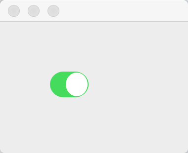

# iOS switch implements in Qt

Swipe to toggle switch or just click on/off side.

## Screenshots

### state on


### state off


## Usage

```
DSwitch *s = new DSwitch(&dialog);
s->setGeometry(50,50, 40, 27) ;
```